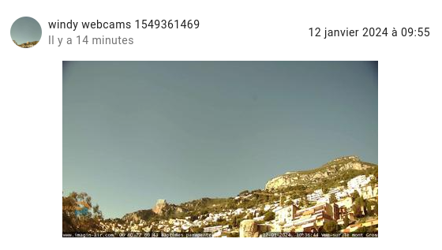
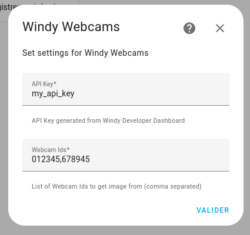
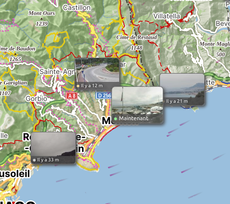
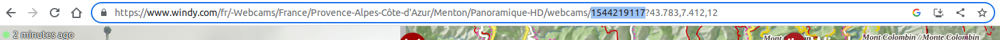
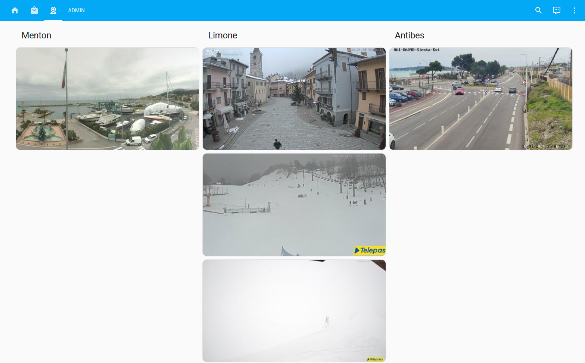

# Windy webcams

Windy webcams integration for Home assistant provides the possibility to track Webcams pictures provided by Windy.

## Image entities

This integration will create for each provided Webcam ID, an image entity that displays the Webcam image.

Example:

## How to install

1. Make sure you have [hacs](https://hacs.xyz/) installed
2. Add this repository as custom repository to hacs by going to hacs, integrations, click on the three dots in the upper right corner and click on custom repositories.
3. In the repository field, fill in the link to this repository (https://github.com/earendil06/Windy-Webcams) and for category, select `Integration`. Click on `Add`
4. Go back to hacs, integrations and add click on the blue button `Exlore and download repositories` in the bottom left corner, search for `Windy Webcams` and install it 
5. Reboot HA
6. In HA goto Config -> Integrations. Add the Windy Webcams integration to HA.
7. In your lovelace dashboard, add a card with the windy webcams entities.

## Configure

The integration has the following options:

**API key**

You must have an API key provided by Windy: [generate one here](https://api.windy.com/)

**Webcam Ids**

Each Webcam ID will create a dedicated image entity.

**IMPORTANT: You need to separate the IDs by a comma.**

## Find a webcam ID

1. Go here: [Official windy website](https://www.windy.com/fr/-Webcams/webcams?43.575,7.053,5)

2. Click on your camera: 

3. Copy the ID:

## Congratulations

It looks soooo nice! :D

